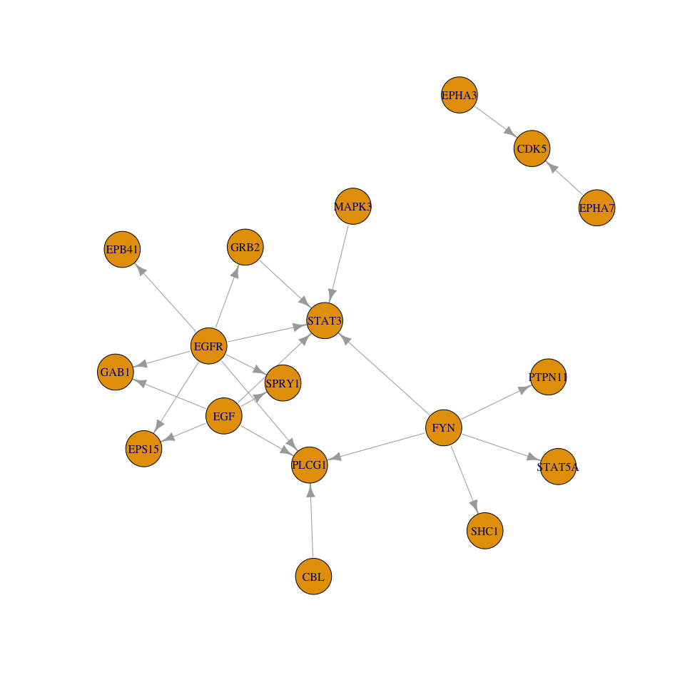
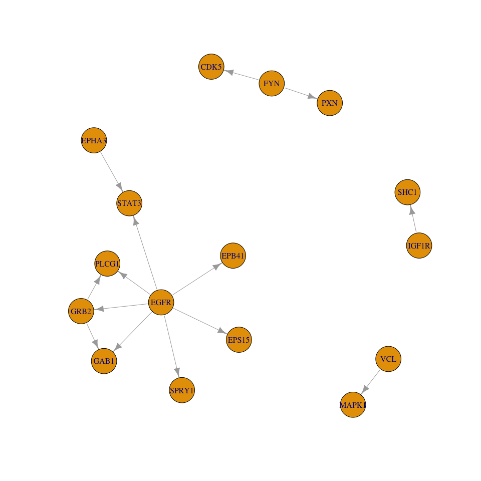

CausalPath
================

Purpose
=======

Example usage of the CausalPath analysis.

Publication
-----------

PDF available here: <https://www.biorxiv.org/content/early/2018/02/05/258855>

Code and Parameter Description
------------------------------

<https://github.com/PathwayAndDataAnalysis/causalpath>

Background
==========

Background: Method
------------------

This method generates causal explanations for proteomic profiles using prior mechanistic knowledge in the literature, as recorded in cellular pathway maps.

Run CausalPath
==============

Parameters
----------

``` bash
cat dataset/parameters.txt
```

    ## proteomics-values-file = data-fdr0.1.txt
    ## id-column = ID
    ## symbols-column = Symbols
    ## sites-column = Sites
    ## effect-column = Effect
    ## 
    ## value-transformation = arithmetic-mean
    ## threshold-for-data-significance = 0.001 phosphoprotein
    ## color-saturation-value = 5
    ## 
    ## calculate-network-significance = true
    ## permutations-for-significance = 100000
    ## fdr-threshold-for-network-significance = 0.1
    ## 
    ## gene-activity = EGF a
    ## 
    ## value-column = 2min

Run CausalPath
--------------

``` bash
java -jar causalpath.jar dataset
```

    ## directory = dataset
    ## Number of relations that go into analysis = 39525
    ## UPREGULATES_EXPRESSION = 9038
    ## DEPHOSPHORYLATES = 2767
    ## INHIBITS_GTPASE = 56
    ## DOWNREGULATES_EXPRESSION = 3004
    ## PHOSPHORYLATES = 24433
    ## ACTIVATES_GTPASE = 227
    ## Graph size pval = 0.0
    ## Causative relations = 23
    ## Conflicting relations = 15
    ## conflict / causative ratio = 0.6521739130434783
    ## accuracy = 0.7894736842105263

Result Visualization
====================

Load Libraries
--------------

``` r
library(paxtoolsr)
```

    ## Loading required package: rJava

    ## Loading required package: XML

    ## Consider citing this package: Luna A, et al. PaxtoolsR: pathway analysis in R using Pathway Commons. PMID: 26685306; citation("paxtoolsr")

``` r
library(igraph)
```

    ## 
    ## Attaching package: 'igraph'

    ## The following objects are masked from 'package:stats':
    ## 
    ##     decompose, spectrum

    ## The following object is masked from 'package:base':
    ## 
    ##     union

Causative Network
-----------------

``` r
sif <- readSif("dataset/causative.sif")
head(sif)
```

    ##   PARTICIPANT_A INTERACTION_TYPE PARTICIPANT_B
    ## 1          EGFR   phosphorylates          GRB2
    ## 2           EGF   phosphorylates         PLCG1
    ## 3          EGFR   phosphorylates         SPRY1
    ## 4           FYN   phosphorylates         STAT3
    ## 5         EPHA7   phosphorylates          CDK5
    ## 6           CBL   phosphorylates         PLCG1
    ##                                                                                                                                                                                                                                                                                                                                                                                                                                                                                                                                                                                                                                                                                                                                                                       NA
    ## 1                                                                                                                                                                                                                                                                                                                                                                                                                                                                                                                                                                                                            http://pathwaycommons.org/pc2/Catalysis_38e16555f8d8a5c3f7d01fbc26ce9090 http://pathwaycommons.org/pc2/BiochemicalReaction_82aa1aee84abdb6d5c428b6bc972afe1
    ## 2                                                                                                                                                                                                                                                                                                                                                                                                    http://pathwaycommons.org/pc2/Catalysis_d14443239cda880fa5514c0a705456b5 http://identifiers.org/reactome/R-HSA-1251922 http://pathwaycommons.org/pc2/Catalysis_6914e8424ae79161aa22e49cfbbb99e6 http://identifiers.org/reactome/R-HSA-212710 http://identifiers.org/reactome/R-HSA-1247844 http://pathwaycommons.org/pc2/Catalysis_d315c0abea01d306914340ffaab330ad
    ## 3                                                                                                                                                                                                                                                                                                                                                                                                                                                                                                                                                                                                                                                  http://identifiers.org/reactome/R-HSA-183089 http://pathwaycommons.org/pc2/Catalysis_bf8183089e3738eca31fb0909b87ecbc
    ## 4 http://identifiers.org/reactome/R-HSA-1470009 http://pathwaycommons.org/pc2/Catalysis_d62e9b0649680e622d87dae995a26a67 http://pathwaycommons.org/pc2/BiochemicalReaction_4b899db29fcf4ef6b7518c36962b3945 http://pathwaycommons.org/pc2/BiochemicalReaction_5763f59f5f6930019f293df57b819285 http://pathwaycommons.org/pc2/BiochemicalReaction_0c7d5414148d6d242a61586911ec29c7 http://pathwaycommons.org/pc2/Catalysis_aec764c03445d1a927c6a379db7c8663 http://pathwaycommons.org/pc2/BiochemicalReaction_83b8c7a7aa54b39d9133c4e5ddcbe673 http://pathwaycommons.org/pc2/Catalysis_fff2797339dce3a86fd8df096c9289cc http://pathwaycommons.org/pc2/Catalysis_195c75bcba7d0263d546807dc19d61b9 http://pathwaycommons.org/pc2/Catalysis_a05f0c2ed73217f92820dd0858f30aa1
    ## 5                                                                                                                                                                                                                                                                                                                                                                                                                                                                                                                                                                                                            http://pathwaycommons.org/pc2/BiochemicalReaction_2055143050943fc372682de74d33e8bf http://pathwaycommons.org/pc2/Catalysis_a6377fbcf16ea5ad72c7dd89d6c47616
    ## 6                                                                                                                                                                                                                                                                                                                                                                                                                                                                                                                                                                                                                                                  http://identifiers.org/reactome/R-HSA-983704 http://pathwaycommons.org/pc2/Catalysis_9091239f1b4ed903c3c2717fe3302637
    ##                     NA
    ## 1            Y168;Y209
    ## 2 Y783;Y771;Y1253;Y472
    ## 3                  Y53
    ## 4            Y727;Y705
    ## 5                  Y15
    ## 6            Y783;Y771

``` r
g <- loadSifInIgraph(sif)
plot(g)
```



Conflicting Network
-------------------

``` r
sif <- readSif("dataset/conflicting.sif")
head(sif)
```

    ##   PARTICIPANT_A INTERACTION_TYPE PARTICIPANT_B
    ## 1           FYN   phosphorylates          CDK5
    ## 2          EGFR   phosphorylates          GRB2
    ## 3         EPHA3   phosphorylates         STAT3
    ## 4          EGFR   phosphorylates         SPRY1
    ## 5          GRB2   phosphorylates          GAB1
    ## 6          EGFR   phosphorylates         EPS15
    ##                                                                                                                                                                                                                                                                                                                                                                                                                                                            NA
    ## 1                                                                                                                                                                           http://pathwaycommons.org/pc2/BiochemicalReaction_e425b907e9d7e6ece07384f250ca15d1 http://pathwaycommons.org/pc2/Catalysis_8025b661900eddb7cea2ba5fc545db4c http://identifiers.org/reactome/R-HSA-399946 http://pathwaycommons.org/pc2/Catalysis_7dffb213cc480c76ca317aa62f571145
    ## 2                                                                                                                                                                                                                                                                                                 http://pathwaycommons.org/pc2/Catalysis_38e16555f8d8a5c3f7d01fbc26ce9090 http://pathwaycommons.org/pc2/BiochemicalReaction_82aa1aee84abdb6d5c428b6bc972afe1
    ## 3                                                                                                                                                                                                                                                                                                                                                                                                                                                            
    ## 4                                                                                                                                                                                                                                                                                                                                       http://identifiers.org/reactome/R-HSA-183089 http://pathwaycommons.org/pc2/Catalysis_bf8183089e3738eca31fb0909b87ecbc
    ## 5                                                                                                                                                                                                                http://pathwaycommons.org/pc2/Catalysis_ff1c40b1308d73e18d194b994f195623 http://identifiers.org/reactome/R-HSA-177930 http://identifiers.org/reactome/R-HSA-8851933 http://pathwaycommons.org/pc2/Catalysis_5f058c6fab68e8c4bf30695cb1638257
    ## 6 http://pathwaycommons.org/pc2/Catalysis_5cee3706838821768b2d44497516a1d0 http://pathwaycommons.org/pc2/Catalysis_407102b087c13258b8a685b3157b0463 http://pathwaycommons.org/pc2/BiochemicalReaction_a5114b78a284c0aaf8cccac36a941456 http://pathwaycommons.org/pc2/TransportWithBiochemicalReaction_526221224216326405ad9b401450052a http://pathwaycommons.org/pc2/Catalysis_4ab494450adc37fffd99f6b5b92348e1 http://identifiers.org/reactome/R-HSA-8867041
    ##                         NA
    ## 1                      Y15
    ## 2                Y168;Y209
    ## 3                     Y705
    ## 4                      Y53
    ## 5 Y589;Y447;Y659;Y627;Y472
    ## 6                Y850;Y849

``` r
g <- loadSifInIgraph(sif)
plot(g)
```



Troubleshooting
===============

Phosphoproteomic Site Locations
-------------------------------

A review of site locations in this work shows that site locations in literature does not always map to the sequence of the canonical protein isoform provided by UniProt. One option is to relax the constraint on exact site matching to allow a difference of 1-2 amino acids.

Session Info
============

``` r
sessionInfo()
```

    ## R version 3.4.2 (2017-09-28)
    ## Platform: x86_64-apple-darwin15.6.0 (64-bit)
    ## Running under: macOS Sierra 10.12.6
    ## 
    ## Matrix products: default
    ## BLAS: /Library/Frameworks/R.framework/Versions/3.4/Resources/lib/libRblas.0.dylib
    ## LAPACK: /Library/Frameworks/R.framework/Versions/3.4/Resources/lib/libRlapack.dylib
    ## 
    ## locale:
    ## [1] en_US.UTF-8/en_US.UTF-8/en_US.UTF-8/C/en_US.UTF-8/en_US.UTF-8
    ## 
    ## attached base packages:
    ## [1] stats     graphics  grDevices utils     datasets  methods   base     
    ## 
    ## other attached packages:
    ## [1] igraph_1.1.2    paxtoolsr_1.6.7 XML_3.98-1.9    rJava_0.9-9    
    ## [5] knitr_1.20     
    ## 
    ## loaded via a namespace (and not attached):
    ##  [1] Rcpp_0.12.16        magrittr_1.5        rjson_0.2.15       
    ##  [4] R6_2.2.2            stringr_1.3.0       httr_1.3.1         
    ##  [7] plyr_1.8.4          tools_3.4.2         data.table_1.10.4-3
    ## [10] R.oo_1.21.0         htmltools_0.3.6     yaml_2.1.18        
    ## [13] rprojroot_1.2       digest_0.6.12       R.utils_2.6.0      
    ## [16] evaluate_0.10.1     rmarkdown_1.8       stringi_1.1.7      
    ## [19] compiler_3.4.2      backports_1.1.1     R.methodsS3_1.7.1  
    ## [22] jsonlite_1.5        pkgconfig_2.0.1
